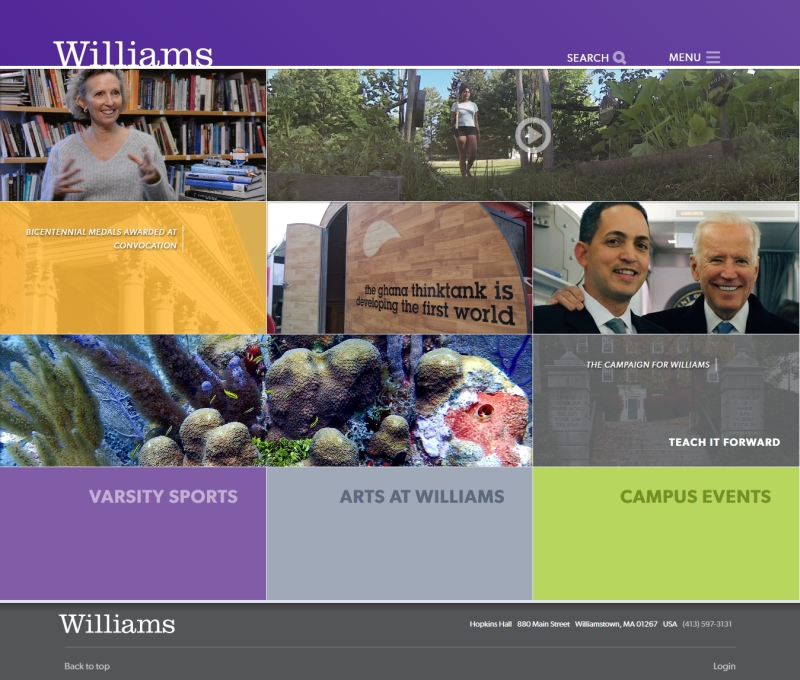
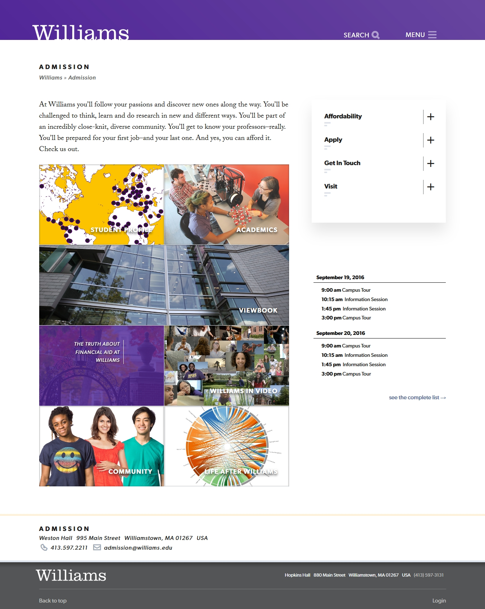

# wp-theme-meerkat16
Legacy Theme for Williams College, fully responsive, utilizing SCSS and Twig/Timber templating engine to separate presentation from logic. I am slowly converting this theme from largely procedural code inherited from the previous iteration of the theme (now a hoary 4+ years-old) to a modular class-based model. Presentation files (\*.twig), controllers (\*.php), styles (\*.scss), and UX interactivity (\*.js) are placed in modules to allow easy maintenance; each major element of the site is governed by a group of files which share an ID.

[See the theme in the wild.](http://www.williams.edu)

##Home Page##

##Internal/Department Page##

